## Hi there 👋

Passionate about programming and Linux with a strong emphasis on
[FLOSS](https://www.gnu.org/philosophy/floss-and-foss.en.html) principles.

During my first year of studying computer science in 2020, I discovered Linux
and haven't looked back. Today I run [Hyprland](https://github.com/hyprwm/Hyprland)
and treat my development environment as a first-class project.

---

### 🛠️ Tech Stack

**Languages:** Python · Go · Lua · Bash  
**Tools:** Neovim · Git · Docker · systemd  
**OS:** Arch Linux

---

### 📦 Projects

| Project                                             | Description                                        | Stack                   |
| --------------------------------------------------- | -------------------------------------------------- | ----------------------- |
| [dotfiles](https://github.com/quantumfate/dotfiles) | Full dev environment bootstrapped with one command | Shell, Chezmoi, Go tmpl |
| [nvim](https://github.com/quantumfate/nvim)         | Minimal, fast Neovim config                        | Lua                     |
| [hypr](https://github.com/quantumfate/hypr)         | Hyprland window manager config                     | Hyprland config         |
| [scripts](https://github.com/quantumfate/scripts)   | Various shell scripts used in my environment       | Shell, Linux, CLI Tools |

---

### 🔄 Open to Work

Actively seeking opportunities in **backend development** and **open source**.  
I prefer roles that align with FLOSS principles, remote-first teams, and meaningful
impact on user sovereignty.

📬 Reach me at: [email](mailto:l.c.holm@proton.me) · [LinkedIn](www.linkedin.com/in/leonconnorholm)

---

### What I care about

Fast, efficient, and private workflows:

- [Dotfiles](https://github.com/quantumfate/dotfiles) — one-command environment bootstrap
- [Custom DVORAK layout](https://github.com/quantumfate/dotfiles?tab=readme-ov-file#custom-dvorak-layout)
- [Neovim config](https://github.com/quantumfate/nvim)
- Privacy stack: [uBlock Origin](https://github.com/gorhill/uBlock) ·
  [ClearURLs](https://github.com/ClearURLs/Addon) ·
  [BetterFox](https://github.com/yokoffing/BetterFox) ·
  [filterlists](https://github.com/yokoffing/filterlists)

  

